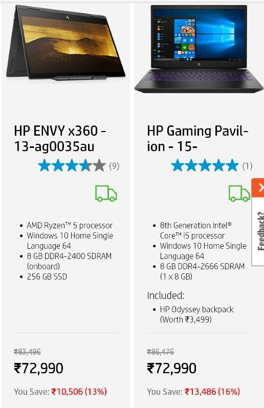
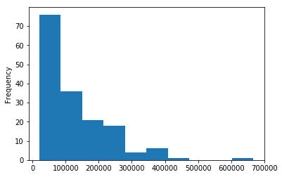
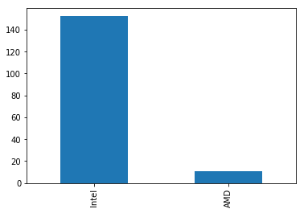
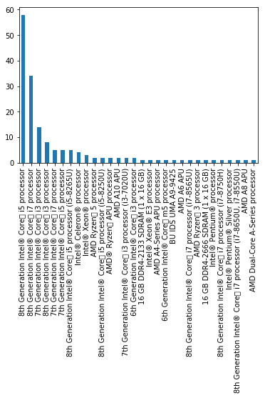
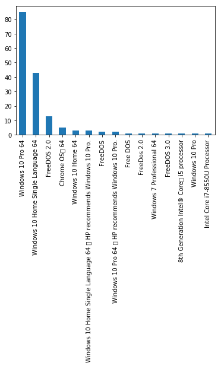
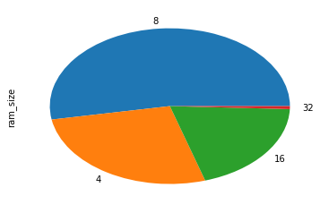
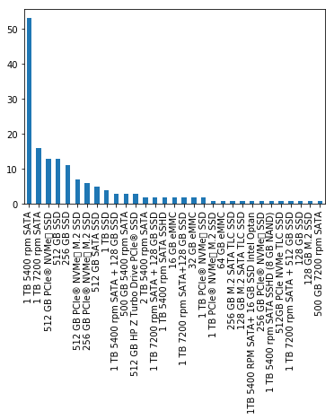
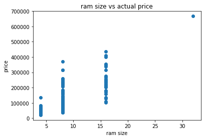

# Web scraping - hp Laptops 


**Web Scraping means extracting information from websites by parsing the HTML of the webpage.**

website used for scraping : https://store.hp.com/in-en/default/laptops-tablets.html

Libraries used:

- **requests** <br>
  Requests gets the web page for you

- **BeautifulSoup**<br>
  you need to parse the HTML from the page to retrieve the data. That is done by BeautifulSoup.

- **re**<br>
  regular expressions module used to make manipulations on data we got.

- **pandas**<br>
  To create the dataframe from the data we got by scraping and creating
  

  
### Importing the above modules


```python
import requests
from bs4 import BeautifulSoup
import re
import pandas as pd
```

### Let's get started

Each Laptop product is rendered in the webpage as follow




```python
prod_list=[]
def getData(products):
    '''
    Takes a List of products and scrapes the required specifications of each product and
    append them to the prod_list defined above.
    '''
    
    for product in products:
        
        #name 
        name=product.find('a',{"class":"product-item-link"}).text.strip()

        #rating of product is in div tag with attribute data-by-average-overall-rating
        rating=product.find('div',attrs={'data-bv-average-overall-rating' : True})['data-bv-average-overall-rating']

        #processor family
        processor=product.find('li',{'class':'processorfamily'})
        if processor is not None:
            processor=processor.text.strip()
        else:
            processor=None
            

        # processor name, generation, type
        if processor is not None:
            try:
                if processor.find('Intel')!=-1:
                    proc_company='Intel'
                    if processor.find('Core')!=-1:  # processor type and generation for Intel core processors
                        generation=re.findall(r'\d',processor)[0] 
                        proc_type=re.findall(r'i\d',processor)[0]
                    else:
                        temp=processor.split()
                        proc_type=' '.join(temp[1:-1]) # processor type for Intel pentium and other series processors

                elif processor.find('AMD')!=-1: # processor type for AMD processors
                    proc_company='AMD' 
                    temp=processor.split()
                    proc_type=temp[1]+' '+temp[2]
                    generation=None
                else:                     # processor type for other processors
                    proc_company=None
                    proc_type=None
                    generation=None
            except:
                print('something went wrong')
        else:
            proc_company=None
            proc_type=None
            generation=None
            

        # Os installed
        os_installed=product.find('li',{'class':'osinstalled'})
        if os_installed is not None:
            os_installed=os_installed.text
        else:
            os_installed=None
            

        # RAM
        ram=product.find('li',{'class':'memstdes_01'})
        if ram is not None:
            ram=ram.text
        else:
            ram=None

        #hard disk
        hd=product.find('li',{'class':'hd_01des'})
        if hd is not None:
            hd=hd.text
        else:
            hd=None

        
        # graphic card information is stored in <li> element with two different classes so multiple classes are used below
        if product.find('li',{'class':['graphicseg_01card_01','graphicseg_02card_01']}) is not None:
            graphic_card=product.find('li',{'class':['graphicseg_01card_01','graphicseg_02card_01']}).text
        else:
            graphic_card=None
            

        #display-type
        display_type=product.find('li',{'class':['display-displaydes']})
        if display_type is None:
            display_type=None
        else:
            display_type=display_type.text


        #price
        
        # actual price, discount and final price all stored in span tag with class price hence we get a list
        prices=product.find_all('span',{'class':'price'})    
        if len(prices)==3:
            aprice=prices[0].text[1:]
            fprice=prices[1].text[1:]
            dprice=prices[2].text[1:]
        else:
            aprice=fprice=prices[0].text[1:] 
            dprice='0'

        #included items
        inc_items=product.find_all('ul',{'class':'included'})

        items_list=[]

        if inc_items is not None:
            for i in inc_items:
                items_list=[item.text for item in i.find_all('li')]
                
        inc_items=','.join(items_list) # converting the list of included items into string seperated by commas

        print('Name:',name)
        print('rating:',rating)
        print("processor:",processor)
        print("processor_company:",proc_company)
        print("processor_type:",proc_type)
        print("generation:",generation)
        print("os_installed:",os_installed)
        print("ram:",ram)
        print("hard_disk:",hd)
        print("graphic_card:",graphic_card)
        print("display:",display_type)
        print("Actual_price:",aprice)
        print("final_price:",fprice)
        print("Discount:",dprice)
        print("included_items:",inc_items)
        
        
        # creating a dictionary with keys as specification names and values as their respective information
        prod_data={
            'Name':name,
            'rating':rating,
            'processor':processor,
            'processor_company':proc_company,
            'processor_type':proc_type,
            'generation':generation,
            'os_installed':os_installed,
            'ram':ram,
            'hard_disk':hd,
            'graphic_card':graphic_card,
            'display':display_type,
            'actual_price':aprice,
            'final_price':fprice,
            'discout':dprice,
            'included_items':inc_items
        }
        
        #Appending the each product to list
        prod_list.append(prod_data)
        
        # end of the product
        print('-'*50)
        
    # end of all products
    print('*'*50)
```

All the products in website is rendered across 6 pages so we set a loop and get the all products of each page at time
and call the getData function defined above


```python
for page_count in range(1,7):
    url='https://store.hp.com/in-en/default/laptops-tablets.html?p='+str(page_count)+'&product_list_limit=30'
    data=requests.get(url) 
    data_soup=BeautifulSoup(data.text,'lxml')
    products=data_soup.find_all("div", {"class": "product-item-details"})
    getData(products)
```

    Name: HP ENVY x360 - 13-ag0035au
    rating: 3.6667
    processor: AMD Ryzen™ 5 processor
    processor_company: AMD
    processor_type: Ryzen™ 5
    generation: None
    os_installed: Windows 10 Home Single Language 64
    ram: 8 GB DDR4-2400 SDRAM (onboard)
    hard_disk: 256 GB SSD
    graphic_card: AMD Radeon™ Vega 8 Graphics
    display: 13.3" FHD multitouch-enabled edge-to-edge glass (1920 x 1080)
    Actual_price: 83,496
    final_price: 72,990
    Discount: 10,506
    included_items: 
    --------------------------------------------------
    Name: HP Gaming Pavilion - 15-cx0140tx
    rating: 5.0000
    processor: 8th Generation Intel® Core™ i5 processor
    processor_company: Intel
    processor_type: i5
    generation: 8
    os_installed: Windows 10 Home Single Language 64
    ram: 8 GB DDR4-2666 SDRAM (1 x 8 GB)
    hard_disk: 1 TB 7200 rpm SATA
    graphic_card: NVIDIA® GeForce® GTX 1050 (4 GB GDDR5 dedicated)
    display: None
    Actual_price: 86,476
    final_price: 72,990
    Discount: 13,486
    included_items: HP Odyssey backpack (Worth ₹3,499),Microsoft Office Home and Student
    --------------------------------------------------
    Name: HP Notebook - 15-da0435tx
    rating: 4.0000
    processor: 7th Generation Intel® Core™ i3 processor
    processor_company: Intel
    processor_type: i3
    generation: 7
    os_installed: Windows 10 Home Single Language 64
    ram: 8 GB DDR4-2133 SDRAM (1 x 8 GB)
    hard_disk: 1 TB 5400 rpm SATA
    graphic_card: NVIDIA® GeForce® MX110 (2 GB DDR3 dedicated)
    display: None
    Actual_price: 50,292
    final_price: 44,580
    Discount: 5,712
    included_items: 
    --------------------------------------------------
    |
    |
    |
    --------------------------------------------------
    Name: HP ProBook 445 G2 Notebook PC (ENERGY STAR)
    rating: 0.0000
    processor: AMD A10 APU
    processor_company: AMD
    processor_type: A10 APU
    generation: None
    os_installed: Windows 10 Pro 64
    ram: 8 GB DDR3L-1600 SDRAM (1 x 8 GB)
    hard_disk: 500 GB 5400 rpm SATA
    graphic_card: AMD Radeon™ R6
    display: 14" diagonal HD anti-glare LED-backlit (1366 x 768)
    Actual_price: 79,000
    final_price: 78,000
    Discount: 1,000
    included_items: HP Overnighter Backpack (Worth ₹2,499)
    --------------------------------------------------
    **************************************************
      

creating a dataframe with the List of products


```python
df=pd.DataFrame(prod_list)
df.head()
```


<div>
<style>
    .dataframe thead tr:only-child th {
        text-align: right;
    }

    .dataframe thead th {
        text-align: left;
    }

    .dataframe tbody tr th {
        vertical-align: top;
    }
</style>
<table border="1" class="dataframe">
  <thead>
    <tr style="text-align: right;">
      <th></th>
      <th>Name</th>
      <th>actual_price</th>
      <th>discout</th>
      <th>display</th>
      <th>final_price</th>
      <th>generation</th>
      <th>graphic_card</th>
      <th>hard_disk</th>
      <th>included_items</th>
      <th>os_installed</th>
      <th>processor</th>
      <th>processor_company</th>
      <th>processor_type</th>
      <th>ram</th>
      <th>rating</th>
    </tr>
  </thead>
  <tbody>
    <tr>
      <th>0</th>
      <td>HP ENVY x360 - 13-ag0035au</td>
      <td>83,496</td>
      <td>10,506</td>
      <td>13.3" FHD multitouch-enabled edge-to-edge glas...</td>
      <td>72,990</td>
      <td>None</td>
      <td>AMD Radeon™ Vega 8 Graphics</td>
      <td>256 GB SSD</td>
      <td></td>
      <td>Windows 10 Home Single Language 64</td>
      <td>AMD Ryzen™ 5 processor</td>
      <td>AMD</td>
      <td>Ryzen™ 5</td>
      <td>8 GB DDR4-2400 SDRAM (onboard)</td>
      <td>3.6667</td>
    </tr>
    <tr>
      <th>1</th>
      <td>HP Gaming Pavilion - 15-cx0140tx</td>
      <td>86,476</td>
      <td>13,486</td>
      <td>None</td>
      <td>72,990</td>
      <td>8</td>
      <td>NVIDIA® GeForce® GTX 1050 (4 GB GDDR5 dedicated)</td>
      <td>1 TB 7200 rpm SATA</td>
      <td>HP Odyssey backpack (Worth ₹3,499),Microsoft O...</td>
      <td>Windows 10 Home Single Language 64</td>
      <td>8th Generation Intel® Core™ i5 processor</td>
      <td>Intel</td>
      <td>i5</td>
      <td>8 GB DDR4-2666 SDRAM (1 x 8 GB)</td>
      <td>5.0000</td>
    </tr>
    <tr>
      <th>2</th>
      <td>HP Notebook - 15-da0435tx</td>
      <td>50,292</td>
      <td>5,712</td>
      <td>None</td>
      <td>44,580</td>
      <td>7</td>
      <td>NVIDIA® GeForce® MX110 (2 GB DDR3 dedicated)</td>
      <td>1 TB 5400 rpm SATA</td>
      <td></td>
      <td>Windows 10 Home Single Language 64</td>
      <td>7th Generation Intel® Core™ i3 processor</td>
      <td>Intel</td>
      <td>i3</td>
      <td>8 GB DDR4-2133 SDRAM (1 x 8 GB)</td>
      <td>4.0000</td>
    </tr>
    <tr>
      <th>3</th>
      <td>HP Notebook - 15g-dr0006tx</td>
      <td>66,137</td>
      <td>7,146</td>
      <td>None</td>
      <td>58,991</td>
      <td>8</td>
      <td>NVIDIA® GeForce® MX110 (2 GB DDR3 dedicated)</td>
      <td>1 TB 5400 rpm SATA</td>
      <td>HP Original Laptop Bag (Worth ₹1,123),1 Year O...</td>
      <td>Windows 10 Home Single Language 64</td>
      <td>8th Generation Intel® Core™ i5 processor</td>
      <td>Intel</td>
      <td>i5</td>
      <td>8 GB DDR4-2400 SDRAM (1 x 8 GB)</td>
      <td>4.0625</td>
    </tr>
    <tr>
      <th>4</th>
      <td>HP Notebook 15-da1030tu</td>
      <td>50,720</td>
      <td>3,730</td>
      <td>None</td>
      <td>46,990</td>
      <td>8</td>
      <td>None</td>
      <td>1 TB 5400 rpm SATA</td>
      <td>HP Original Laptop Bag (Worth ₹1,123),Microsof...</td>
      <td>Windows 10 Home 64</td>
      <td>8th Generation Intel® Core™ i5 processor</td>
      <td>Intel</td>
      <td>i5</td>
      <td>4 GB DDR4-2400 SDRAM</td>
      <td>2.0000</td>
    </tr>
  </tbody>
</table>
</div>


saving the dataframe into Hp_laptops.csv


```python
df.to_csv("Hp_laptops.csv")
```


```python
import numpy as np # linear algebra
import pandas as pd # data processing, CSV file I/O (e.g. pd.read_csv)
import matplotlib.pyplot as plt # visualization
import re
%matplotlib inline
```

**To get a brief overview, this notebook is dedicated to 5 sections as follows**
1. Context of dataset
2. Data cleaning
3. EDA
4. Results
5. Conclusion

**Loading file Hp_laptos.csv into dataframe**


```python
df=pd.read_csv('Hp_laptops.csv',encoding='unicode-escape')
```

**Let's have glance at a bit of data**


```python
df.head()
```


<div>
<style>
    .dataframe thead tr:only-child th {
        text-align: right;
    }

    .dataframe thead th {
        text-align: left;
    }

    .dataframe tbody tr th {
        vertical-align: top;
    }
</style>
<table border="1" class="dataframe">
  <thead>
    <tr style="text-align: right;">
      <th></th>
      <th>Unnamed: 0</th>
      <th>Name</th>
      <th>actual_price</th>
      <th>discout</th>
      <th>display</th>
      <th>final_price</th>
      <th>generation</th>
      <th>graphic_card</th>
      <th>hard_disk</th>
      <th>included_items</th>
      <th>os_installed</th>
      <th>processor</th>
      <th>processor_company</th>
      <th>processor_type</th>
      <th>ram</th>
      <th>rating</th>
    </tr>
  </thead>
  <tbody>
    <tr>
      <th>0</th>
      <td>0</td>
      <td>HP ENVY x360 - 13-ag0035au</td>
      <td>83,496</td>
      <td>10,506</td>
      <td>13.3" FHD multitouch-enabled edge-to-edge glas...</td>
      <td>72,990</td>
      <td>NaN</td>
      <td>AMD Radeon™ Vega 8 Graphics</td>
      <td>256 GB SSD</td>
      <td>NaN</td>
      <td>Windows 10 Home Single Language 64</td>
      <td>AMD Ryzen™ 5 processor</td>
      <td>AMD</td>
      <td>Ryzen™ 5</td>
      <td>8 GB DDR4-2400 SDRAM (onboard)</td>
      <td>3.6667</td>
    </tr>
    <tr>
      <th>1</th>
      <td>1</td>
      <td>HP Gaming Pavilion - 15-cx0140tx</td>
      <td>86,476</td>
      <td>13,486</td>
      <td>NaN</td>
      <td>72,990</td>
      <td>8.0</td>
      <td>NVIDIA® GeForce® GTX 1050 (4 GB GDDR5 dedicated)</td>
      <td>1 TB 7200 rpm SATA</td>
      <td>HP Odyssey backpack (Worth ?3,499),Microsoft O...</td>
      <td>Windows 10 Home Single Language 64</td>
      <td>8th Generation Intel® Core™ i5 processor</td>
      <td>Intel</td>
      <td>i5</td>
      <td>8 GB DDR4-2666 SDRAM (1 x 8 GB)</td>
      <td>5.0000</td>
    </tr>
    <tr>
      <th>2</th>
      <td>2</td>
      <td>HP Notebook - 15-da0435tx</td>
      <td>50,292</td>
      <td>5,712</td>
      <td>NaN</td>
      <td>44,580</td>
      <td>7.0</td>
      <td>NVIDIA® GeForce® MX110 (2 GB DDR3 dedicated)</td>
      <td>1 TB 5400 rpm SATA</td>
      <td>NaN</td>
      <td>Windows 10 Home Single Language 64</td>
      <td>7th Generation Intel® Core™ i3 processor</td>
      <td>Intel</td>
      <td>i3</td>
      <td>8 GB DDR4-2133 SDRAM (1 x 8 GB)</td>
      <td>4.0000</td>
    </tr>
    <tr>
      <th>3</th>
      <td>3</td>
      <td>HP Notebook - 15g-dr0006tx</td>
      <td>66,137</td>
      <td>7,146</td>
      <td>NaN</td>
      <td>58,991</td>
      <td>8.0</td>
      <td>NVIDIA® GeForce® MX110 (2 GB DDR3 dedicated)</td>
      <td>1 TB 5400 rpm SATA</td>
      <td>HP Original Laptop Bag (Worth ?1,123),1 Year O...</td>
      <td>Windows 10 Home Single Language 64</td>
      <td>8th Generation Intel® Core™ i5 processor</td>
      <td>Intel</td>
      <td>i5</td>
      <td>8 GB DDR4-2400 SDRAM (1 x 8 GB)</td>
      <td>4.0625</td>
    </tr>
    <tr>
      <th>4</th>
      <td>4</td>
      <td>HP Notebook 15-da1030tu</td>
      <td>50,720</td>
      <td>3,730</td>
      <td>NaN</td>
      <td>46,990</td>
      <td>8.0</td>
      <td>NaN</td>
      <td>1 TB 5400 rpm SATA</td>
      <td>HP Original Laptop Bag (Worth ?1,123),Microsof...</td>
      <td>Windows 10 Home 64</td>
      <td>8th Generation Intel® Core™ i5 processor</td>
      <td>Intel</td>
      <td>i5</td>
      <td>4 GB DDR4-2400 SDRAM</td>
      <td>2.0000</td>
    </tr>
  </tbody>
</table>
</div>


**Information of each column in the dataframe**


```python
df.info()
```

    <class 'pandas.core.frame.DataFrame'>
    RangeIndex: 163 entries, 0 to 162
    Data columns (total 16 columns):
    Unnamed: 0           163 non-null int64
    Name                 163 non-null object
    actual_price         163 non-null object
    discout              163 non-null object
    display              29 non-null object
    final_price          163 non-null object
    generation           131 non-null float64
    graphic_card         161 non-null object
    hard_disk            161 non-null object
    included_items       131 non-null object
    os_installed         163 non-null object
    processor            149 non-null object
    processor_company    146 non-null object
    processor_type       146 non-null object
    ram                  161 non-null object
    rating               158 non-null float64
    dtypes: float64(2), int64(1), object(13)
    memory usage: 20.5+ KB
    

**Shape of the dataframe**


```python
df.shape
```


    (163, 16)


In the dataframe first column is no use at all 

**Dropping the first column**


```python
df.drop(['Unnamed: 0'],axis=1,inplace=True)
```

**Data cleaning**

- check if any NA's are present


```python
df.isnull().sum()
```


    Name                   0
    actual_price           0
    discout                0
    display              134
    final_price            0
    generation            32
    graphic_card           2
    hard_disk              2
    included_items        32
    os_installed           0
    processor             14
    processor_company     17
    processor_type        17
    ram                    2
    rating                 5
    dtype: int64


The column display has 134 NaN values which is more than 40% of total data. So we can drop it


```python
df.drop(['display'],axis=1,inplace=True)
```


```python
df.head()
```


<div>
<style>
    .dataframe thead tr:only-child th {
        text-align: right;
    }

    .dataframe thead th {
        text-align: left;
    }

    .dataframe tbody tr th {
        vertical-align: top;
    }
</style>
<table border="1" class="dataframe">
  <thead>
    <tr style="text-align: right;">
      <th></th>
      <th>Name</th>
      <th>actual_price</th>
      <th>discout</th>
      <th>final_price</th>
      <th>generation</th>
      <th>graphic_card</th>
      <th>hard_disk</th>
      <th>included_items</th>
      <th>os_installed</th>
      <th>processor</th>
      <th>processor_company</th>
      <th>processor_type</th>
      <th>ram</th>
      <th>rating</th>
    </tr>
  </thead>
  <tbody>
    <tr>
      <th>0</th>
      <td>HP ENVY x360 - 13-ag0035au</td>
      <td>83,496</td>
      <td>10,506</td>
      <td>72,990</td>
      <td>NaN</td>
      <td>AMD Radeon™ Vega 8 Graphics</td>
      <td>256 GB SSD</td>
      <td>NaN</td>
      <td>Windows 10 Home Single Language 64</td>
      <td>AMD Ryzen™ 5 processor</td>
      <td>AMD</td>
      <td>Ryzen™ 5</td>
      <td>8 GB DDR4-2400 SDRAM (onboard)</td>
      <td>3.6667</td>
    </tr>
    <tr>
      <th>1</th>
      <td>HP Gaming Pavilion - 15-cx0140tx</td>
      <td>86,476</td>
      <td>13,486</td>
      <td>72,990</td>
      <td>8.0</td>
      <td>NVIDIA® GeForce® GTX 1050 (4 GB GDDR5 dedicated)</td>
      <td>1 TB 7200 rpm SATA</td>
      <td>HP Odyssey backpack (Worth ?3,499),Microsoft O...</td>
      <td>Windows 10 Home Single Language 64</td>
      <td>8th Generation Intel® Core™ i5 processor</td>
      <td>Intel</td>
      <td>i5</td>
      <td>8 GB DDR4-2666 SDRAM (1 x 8 GB)</td>
      <td>5.0000</td>
    </tr>
    <tr>
      <th>2</th>
      <td>HP Notebook - 15-da0435tx</td>
      <td>50,292</td>
      <td>5,712</td>
      <td>44,580</td>
      <td>7.0</td>
      <td>NVIDIA® GeForce® MX110 (2 GB DDR3 dedicated)</td>
      <td>1 TB 5400 rpm SATA</td>
      <td>NaN</td>
      <td>Windows 10 Home Single Language 64</td>
      <td>7th Generation Intel® Core™ i3 processor</td>
      <td>Intel</td>
      <td>i3</td>
      <td>8 GB DDR4-2133 SDRAM (1 x 8 GB)</td>
      <td>4.0000</td>
    </tr>
    <tr>
      <th>3</th>
      <td>HP Notebook - 15g-dr0006tx</td>
      <td>66,137</td>
      <td>7,146</td>
      <td>58,991</td>
      <td>8.0</td>
      <td>NVIDIA® GeForce® MX110 (2 GB DDR3 dedicated)</td>
      <td>1 TB 5400 rpm SATA</td>
      <td>HP Original Laptop Bag (Worth ?1,123),1 Year O...</td>
      <td>Windows 10 Home Single Language 64</td>
      <td>8th Generation Intel® Core™ i5 processor</td>
      <td>Intel</td>
      <td>i5</td>
      <td>8 GB DDR4-2400 SDRAM (1 x 8 GB)</td>
      <td>4.0625</td>
    </tr>
    <tr>
      <th>4</th>
      <td>HP Notebook 15-da1030tu</td>
      <td>50,720</td>
      <td>3,730</td>
      <td>46,990</td>
      <td>8.0</td>
      <td>NaN</td>
      <td>1 TB 5400 rpm SATA</td>
      <td>HP Original Laptop Bag (Worth ?1,123),Microsof...</td>
      <td>Windows 10 Home 64</td>
      <td>8th Generation Intel® Core™ i5 processor</td>
      <td>Intel</td>
      <td>i5</td>
      <td>4 GB DDR4-2400 SDRAM</td>
      <td>2.0000</td>
    </tr>
  </tbody>
</table>
</div>


```python
df.actual_price.dtype
```


    dtype('O')


In the dataframe actual_price,final_price and discount columns should be of numerical datatype but they are of object datatype 
in the dataframe so function strtoint is definded below which removes the comma in the values and convert them into int datatype


```python
def strtoint(column):
    return column.apply(lambda x:int(x.replace(',','')))
```


```python
df['actual_price']=strtoint(df['actual_price'])
df['discout']=strtoint(df['discout'])
df['final_price']=strtoint(df['final_price'])
```


```python
df.head()
```


<div>
<style>
    .dataframe thead tr:only-child th {
        text-align: right;
    }

    .dataframe thead th {
        text-align: left;
    }

    .dataframe tbody tr th {
        vertical-align: top;
    }
</style>
<table border="1" class="dataframe">
  <thead>
    <tr style="text-align: right;">
      <th></th>
      <th>Name</th>
      <th>actual_price</th>
      <th>discout</th>
      <th>final_price</th>
      <th>generation</th>
      <th>graphic_card</th>
      <th>hard_disk</th>
      <th>included_items</th>
      <th>os_installed</th>
      <th>processor</th>
      <th>processor_company</th>
      <th>processor_type</th>
      <th>ram</th>
      <th>rating</th>
    </tr>
  </thead>
  <tbody>
    <tr>
      <th>0</th>
      <td>HP ENVY x360 - 13-ag0035au</td>
      <td>83496</td>
      <td>10506</td>
      <td>72990</td>
      <td>NaN</td>
      <td>AMD Radeon™ Vega 8 Graphics</td>
      <td>256 GB SSD</td>
      <td>NaN</td>
      <td>Windows 10 Home Single Language 64</td>
      <td>AMD Ryzen™ 5 processor</td>
      <td>AMD</td>
      <td>Ryzen™ 5</td>
      <td>8 GB DDR4-2400 SDRAM (onboard)</td>
      <td>3.6667</td>
    </tr>
    <tr>
      <th>1</th>
      <td>HP Gaming Pavilion - 15-cx0140tx</td>
      <td>86476</td>
      <td>13486</td>
      <td>72990</td>
      <td>8.0</td>
      <td>NVIDIA® GeForce® GTX 1050 (4 GB GDDR5 dedicated)</td>
      <td>1 TB 7200 rpm SATA</td>
      <td>HP Odyssey backpack (Worth ?3,499),Microsoft O...</td>
      <td>Windows 10 Home Single Language 64</td>
      <td>8th Generation Intel® Core™ i5 processor</td>
      <td>Intel</td>
      <td>i5</td>
      <td>8 GB DDR4-2666 SDRAM (1 x 8 GB)</td>
      <td>5.0000</td>
    </tr>
    <tr>
      <th>2</th>
      <td>HP Notebook - 15-da0435tx</td>
      <td>50292</td>
      <td>5712</td>
      <td>44580</td>
      <td>7.0</td>
      <td>NVIDIA® GeForce® MX110 (2 GB DDR3 dedicated)</td>
      <td>1 TB 5400 rpm SATA</td>
      <td>NaN</td>
      <td>Windows 10 Home Single Language 64</td>
      <td>7th Generation Intel® Core™ i3 processor</td>
      <td>Intel</td>
      <td>i3</td>
      <td>8 GB DDR4-2133 SDRAM (1 x 8 GB)</td>
      <td>4.0000</td>
    </tr>
    <tr>
      <th>3</th>
      <td>HP Notebook - 15g-dr0006tx</td>
      <td>66137</td>
      <td>7146</td>
      <td>58991</td>
      <td>8.0</td>
      <td>NVIDIA® GeForce® MX110 (2 GB DDR3 dedicated)</td>
      <td>1 TB 5400 rpm SATA</td>
      <td>HP Original Laptop Bag (Worth ?1,123),1 Year O...</td>
      <td>Windows 10 Home Single Language 64</td>
      <td>8th Generation Intel® Core™ i5 processor</td>
      <td>Intel</td>
      <td>i5</td>
      <td>8 GB DDR4-2400 SDRAM (1 x 8 GB)</td>
      <td>4.0625</td>
    </tr>
    <tr>
      <th>4</th>
      <td>HP Notebook 15-da1030tu</td>
      <td>50720</td>
      <td>3730</td>
      <td>46990</td>
      <td>8.0</td>
      <td>NaN</td>
      <td>1 TB 5400 rpm SATA</td>
      <td>HP Original Laptop Bag (Worth ?1,123),Microsof...</td>
      <td>Windows 10 Home 64</td>
      <td>8th Generation Intel® Core™ i5 processor</td>
      <td>Intel</td>
      <td>i5</td>
      <td>4 GB DDR4-2400 SDRAM</td>
      <td>2.0000</td>
    </tr>
  </tbody>
</table>
</div>


The generation column has 32 missing values Let's see the unique values and their frequency details


```python
df.generation.value_counts()
```


    8.0    99
    7.0    29
    6.0     3
    Name: generation, dtype: int64


generations are for the Intel core processor series. AMD, Intel pentium series doesn't have generation so replace those with version 1


```python
df.generation.fillna('1.0',inplace=True)
df.generation.isnull().sum()
```


    0


The column graphic_card has two null values.Let's fill them with mode of that column


```python
df.graphic_card.value_counts()[:5]
```


    Intel® UHD Graphics 620                                    54
    Intel® HD Graphics 620                                     19
    AMD Radeon™ Pro WX 3100 Graphics (2 GB GDDR5 dedicated)    12
    NVIDIA® Quadro® P1000 (4 GB GDDR5 dedicated)                8
    NVIDIA® Quadro® P600 (4 GB GDDR5 dedicated)                 7
    Name: graphic_card, dtype: int64


```python
df.graphic_card.fillna(df.graphic_card.mode()[0],inplace=True)
df.graphic_card.isnull().sum()
```


    0


```python
df.hard_disk.value_counts()[:5]
```


    1 TB 5400 rpm SATA        51
    1 TB 7200 rpm SATA        16
    512 GB PCIe® NVMe™ SSD    13
    512 GB SSD                13
    256 GB SSD                11
    Name: hard_disk, dtype: int64


```python
df.hard_disk.fillna(df.hard_disk.mode()[0],inplace=True)
df.hard_disk.isnull().sum()
```


    0


```python
df.included_items.fillna('Not provided',inplace=True)
df.included_items.isnull().sum()
```


    0


```python
df.ram.fillna(df.ram.mode()[0],inplace=True)
df.included_items.isnull().sum()
```


    0


```python
df.rating.fillna(df.rating.mean(),inplace=True)
df.rating.isnull().sum()
```


    0


```python
df[df.processor_company.isnull()]
```


<div>
<style>
    .dataframe thead tr:only-child th {
        text-align: right;
    }

    .dataframe thead th {
        text-align: left;
    }

    .dataframe tbody tr th {
        vertical-align: top;
    }
</style>
<table border="1" class="dataframe">
  <thead>
    <tr style="text-align: right;">
      <th></th>
      <th>Name</th>
      <th>actual_price</th>
      <th>discout</th>
      <th>final_price</th>
      <th>generation</th>
      <th>graphic_card</th>
      <th>hard_disk</th>
      <th>included_items</th>
      <th>os_installed</th>
      <th>processor</th>
      <th>processor_company</th>
      <th>processor_type</th>
      <th>ram</th>
      <th>rating</th>
    </tr>
  </thead>
  <tbody>
    <tr>
      <th>40</th>
      <td>HP ZBook 15v G5 Mobile Workstation</td>
      <td>225937</td>
      <td>22095</td>
      <td>203842</td>
      <td>1.0</td>
      <td>NVIDIA® Quadro® P600 (4 GB GDDR5 dedicated)</td>
      <td>1 TB 7200 rpm SATA</td>
      <td>HP Original Bag  (Worth ?1,499) (#5DD44PA),3 Y...</td>
      <td>Windows 10 Pro 64</td>
      <td>16 GB DDR4-2666 SDRAM (1 x 16 GB)</td>
      <td>NaN</td>
      <td>NaN</td>
      <td>8 GB DDR4-2400 SDRAM (1 x 8 GB)</td>
      <td>1.194378</td>
    </tr>
    <tr>
      <th>41</th>
      <td>HP ZBook 15v G5 Mobile Workstation</td>
      <td>233611</td>
      <td>22861</td>
      <td>210750</td>
      <td>1.0</td>
      <td>NVIDIA® Quadro® P600 (4 GB GDDR5 dedicated)</td>
      <td>256 GB SSD</td>
      <td>HP Original Bag  (Worth ?1,499) (#5DD44PA),3 Y...</td>
      <td>Windows 10 Pro 64</td>
      <td>NaN</td>
      <td>NaN</td>
      <td>NaN</td>
      <td>16 GB DDR4-2666 SDRAM (1 x 16 GB)</td>
      <td>1.194378</td>
    </tr>
    <tr>
      <th>42</th>
      <td>HP ZBook 15v G5 Mobile Workstation</td>
      <td>216245</td>
      <td>21125</td>
      <td>195120</td>
      <td>1.0</td>
      <td>NVIDIA® Quadro® P600 (4 GB GDDR5 dedicated)</td>
      <td>1 TB 7200 rpm SATA</td>
      <td>HP Original Bag  (Worth ?1,499) (#5DD44PA),3 Y...</td>
      <td>Windows 10 Pro 64</td>
      <td>NaN</td>
      <td>NaN</td>
      <td>NaN</td>
      <td>16 GB DDR4-2666 SDRAM (1 x 16 GB)</td>
      <td>1.194378</td>
    </tr>
    <tr>
      <th>43</th>
      <td>HP ZBook 15v G5 Mobile Workstation</td>
      <td>203281</td>
      <td>19828</td>
      <td>183453</td>
      <td>1.0</td>
      <td>NVIDIA® Quadro® P600 (4 GB GDDR5 dedicated)</td>
      <td>2 TB 5400 rpm SATA</td>
      <td>HP Original Bag  (Worth ?1,499) (#5DD44PA),3 Y...</td>
      <td>Windows 10 Pro 64</td>
      <td>NaN</td>
      <td>NaN</td>
      <td>NaN</td>
      <td>16 GB DDR4-2666 SDRAM (1 x 16 GB)</td>
      <td>1.194378</td>
    </tr>
    <tr>
      <th>44</th>
      <td>HP ZBook 15v G5 Mobile Workstation</td>
      <td>181301</td>
      <td>17100</td>
      <td>164201</td>
      <td>1.0</td>
      <td>NVIDIA® Quadro® P600 (4 GB GDDR5 dedicated)</td>
      <td>1 TB 7200 rpm SATA</td>
      <td>HP Original Bag  (Worth ?1,499) (#5DD44PA),3 Y...</td>
      <td>Windows 10 Pro 64</td>
      <td>NaN</td>
      <td>NaN</td>
      <td>NaN</td>
      <td>16 GB DDR4-2666 SDRAM (1 x 16 GB)</td>
      <td>1.194378</td>
    </tr>
    <tr>
      <th>106</th>
      <td>HP ZBook 15 G5 Mobile Workstation</td>
      <td>350406</td>
      <td>124853</td>
      <td>225553</td>
      <td>1.0</td>
      <td>NVIDIA® Quadro® P2000 (4 GB GDDR5 dedicated)</td>
      <td>1 TB 7200 rpm SATA + 512 GB SSD</td>
      <td>HP Business Backpack (Worth ?4,200)</td>
      <td>Windows 10 Pro 64</td>
      <td>NaN</td>
      <td>NaN</td>
      <td>NaN</td>
      <td>16 GB (1x16 GB) DDR4 2666</td>
      <td>0.000000</td>
    </tr>
    <tr>
      <th>107</th>
      <td>HP ZBook 15 G5 Mobile Workstation</td>
      <td>316190</td>
      <td>110771</td>
      <td>205419</td>
      <td>1.0</td>
      <td>NVIDIA® Quadro® P1000 (4 GB GDDR5 dedicated)</td>
      <td>1 TB 7200 rpm SATA + 128 GB SSD</td>
      <td>HP Business Backpack (Worth ?4,200)</td>
      <td>Windows 10 Pro 64</td>
      <td>NaN</td>
      <td>NaN</td>
      <td>NaN</td>
      <td>8 GB DDR4-2666 SDRAM (1 x 8 GB)</td>
      <td>0.000000</td>
    </tr>
    <tr>
      <th>108</th>
      <td>HP ZBook 15 G5 Mobile Workstation</td>
      <td>240765</td>
      <td>83941</td>
      <td>156824</td>
      <td>1.0</td>
      <td>NVIDIA® Quadro® P1000 (4 GB GDDR5 dedicated)</td>
      <td>1 TB 7200 rpm SATA</td>
      <td>HP Business Backpack (Worth ?4,200)</td>
      <td>Windows 10 Pro 64</td>
      <td>NaN</td>
      <td>NaN</td>
      <td>NaN</td>
      <td>8 GB DDR4-2666 SDRAM (1 x 8 GB)</td>
      <td>0.000000</td>
    </tr>
    <tr>
      <th>109</th>
      <td>HP ZBook x2 G4 Detachable Workstation</td>
      <td>408283</td>
      <td>145897</td>
      <td>262386</td>
      <td>1.0</td>
      <td>NVIDIA® Quadro® M620 (2 GB GDDR5 dedicated)</td>
      <td>512 GB SSD</td>
      <td>HP Business Backpack (Worth ?4,200)</td>
      <td>Windows 10 Pro 64</td>
      <td>NaN</td>
      <td>NaN</td>
      <td>NaN</td>
      <td>16 GB DDR4-2133 SDRAM (2 x 8 GB)</td>
      <td>0.000000</td>
    </tr>
    <tr>
      <th>110</th>
      <td>HP ZBook x2 G4 Detachable Workstation</td>
      <td>369052</td>
      <td>128360</td>
      <td>240692</td>
      <td>1.0</td>
      <td>NVIDIA® Quadro® M620 (2 GB GDDR5 dedicated)</td>
      <td>512 GB SSD</td>
      <td>HP Business Backpack (Worth ?4,200)</td>
      <td>Windows 10 Pro 64</td>
      <td>NaN</td>
      <td>NaN</td>
      <td>NaN</td>
      <td>8 GB DDR4-2133 SDRAM (2 x 4 GB)</td>
      <td>0.000000</td>
    </tr>
    <tr>
      <th>111</th>
      <td>HP ZBook Studio x360 G5 Convertible Workstation</td>
      <td>400665</td>
      <td>144380</td>
      <td>256285</td>
      <td>1.0</td>
      <td>NVIDIA® Quadro® P1000 (4 GB GDDR5 dedicated)</td>
      <td>1 TB SSD</td>
      <td>HP Business Backpack (Worth ?4,200)</td>
      <td>Windows 10 Pro 64</td>
      <td>NaN</td>
      <td>NaN</td>
      <td>NaN</td>
      <td>16 GB DDR4-2666 SDRAM (1 x 16 GB)</td>
      <td>0.000000</td>
    </tr>
    <tr>
      <th>113</th>
      <td>HP ZBook Studio G5 Mobile Workstation</td>
      <td>254780</td>
      <td>89781</td>
      <td>164999</td>
      <td>1.0</td>
      <td>NVIDIA® Quadro® P1000 (4 GB GDDR5 dedicated)</td>
      <td>512 GB SSD</td>
      <td>HP Business Backpack (Worth ?4,200)</td>
      <td>Windows 10 Pro 64</td>
      <td>NaN</td>
      <td>NaN</td>
      <td>NaN</td>
      <td>8 GB DDR4-2666 SDRAM (1 x 8 GB)</td>
      <td>0.000000</td>
    </tr>
    <tr>
      <th>122</th>
      <td>HP ProBook 640 G4 Notebook PC</td>
      <td>95603</td>
      <td>2830</td>
      <td>92773</td>
      <td>1.0</td>
      <td>Intel® UHD Graphics 620</td>
      <td>1 TB 7200 rpm SATA</td>
      <td>HP Overnighter Backpack (Worth ?2,499)</td>
      <td>8th Generation Intel® Core™ i5 processor</td>
      <td>NaN</td>
      <td>NaN</td>
      <td>NaN</td>
      <td>8 GB DDR4-2400 SDRAM (1 x 8 GB)</td>
      <td>0.000000</td>
    </tr>
    <tr>
      <th>123</th>
      <td>HP ProBook 640 G4 Notebook PC</td>
      <td>106867</td>
      <td>3164</td>
      <td>103703</td>
      <td>1.0</td>
      <td>Intel® UHD Graphics 620</td>
      <td>1 TB 7200 rpm SATA</td>
      <td>HP Overnighter Backpack (Worth ?2,499)</td>
      <td>Intel Core i7-8550U Processor</td>
      <td>NaN</td>
      <td>NaN</td>
      <td>NaN</td>
      <td>8 GB DDR4-2400 SDRAM (1 x 8 GB)</td>
      <td>0.000000</td>
    </tr>
    <tr>
      <th>126</th>
      <td>HP ZBook 15u G4 Mobile Workstation</td>
      <td>176453</td>
      <td>5453</td>
      <td>171000</td>
      <td>1.0</td>
      <td>AMD FirePro™ W4190M Graphics (2 GB GDDR5 dedic...</td>
      <td>1 TB 5400 rpm SATA</td>
      <td>Not provided</td>
      <td>Windows 10 Pro 64</td>
      <td>16 GB DDR4-2133 SDRAM (1 x 16 GB)</td>
      <td>NaN</td>
      <td>NaN</td>
      <td>8 GB DDR4-2400 SDRAM (1 x 8 GB)</td>
      <td>0.000000</td>
    </tr>
    <tr>
      <th>146</th>
      <td>HP 245 G6</td>
      <td>24200</td>
      <td>0</td>
      <td>24200</td>
      <td>1.0</td>
      <td>Intel® UHD Graphics 620</td>
      <td>1 TB 5400 rpm SATA</td>
      <td>Not provided</td>
      <td>FreeDOS</td>
      <td>BU IDS UMA A9-9425</td>
      <td>NaN</td>
      <td>NaN</td>
      <td>4GB (1x4GB) 1866 DDR4</td>
      <td>0.000000</td>
    </tr>
    <tr>
      <th>150</th>
      <td>HP ZBook 15u G5 Mobile Workstation</td>
      <td>264534</td>
      <td>103017</td>
      <td>161517</td>
      <td>1.0</td>
      <td>AMD Radeon™ Pro WX 3100 Graphics (2 GB GDDR5 d...</td>
      <td>512 GB SSD</td>
      <td>HP Business Backpack (Worth ?4,200)</td>
      <td>Windows 10 Pro 64</td>
      <td>NaN</td>
      <td>NaN</td>
      <td>NaN</td>
      <td>16 GB DDR4-2400 SDRAM (1 x 16 GB)</td>
      <td>0.000000</td>
    </tr>
  </tbody>
</table>
</div>


```python
print(df.processor_type.mode()[0])
print(df.processor.mode()[0])
print(df.processor_company.mode()[0])
```

    i5
    8th Generation Intel® Core™ i5 processor
    Intel
    


```python
df.at[38, 'processor']=df.processor.mode()[0]
df.at[120,'processor']=df.processor.mode()[0]
df.at[147,'processor']=df.processor.mode()[0]
df.processor.fillna(df.processor.mode()[0],inplace=True)
df.processor_company.fillna(df.processor_company.mode()[0],inplace=True)
df.processor_type.fillna(df.processor_type.mode()[0],inplace=True)
```


```python
df.isnull().sum()
```


    Name                 0
    actual_price         0
    discout              0
    final_price          0
    generation           0
    graphic_card         0
    hard_disk            0
    included_items       0
    os_installed         0
    processor            0
    processor_company    0
    processor_type       0
    ram                  0
    rating               0
    dtype: int64


### creating a new column with ram size


```python
import re
def getSize(value):
    b=re.findall(r'\b\d+',str(value))
    if len(b)>0:
        return b[0]
    return None
df['ram_size']=df['ram'].apply(getSize)
```


```python
df['ram_size'].value_counts()
```


    8     86
    4     44
    16    32
    32     1
    Name: ram_size, dtype: int64


```python
df.ram_size.isnull().sum()
```


    0


```python
df.ram_size=df.ram_size.astype('int')
```

### creating a new column with hard disk size


```python
def getSize(value):
    p=re.compile(r'\b\d+\s\w+')
    val=p.findall(value)
    size=None
    if len(val)>0:
        size=val[0]
        size_val=re.findall(r'\d+',size)[0]
        if 'TB' in size:
            size_val=int(size_val)*1024
        return size_val
    return size
```


```python
df['hd_size(GB)']=df.hard_disk.apply(getSize)
```


```python
df['hd_size(GB)'].isnull().sum()
```


    1


```python
df['hd_size(GB)'].fillna(df['hd_size(GB)'].mode()[0],inplace=True)
```


```python
df['hd_size(GB)']=df['hd_size(GB)'].astype('int')
```


```python
df.head()
```


<div>
<style>
    .dataframe thead tr:only-child th {
        text-align: right;
    }

    .dataframe thead th {
        text-align: left;
    }

    .dataframe tbody tr th {
        vertical-align: top;
    }
</style>
<table border="1" class="dataframe">
  <thead>
    <tr style="text-align: right;">
      <th></th>
      <th>Name</th>
      <th>actual_price</th>
      <th>discout</th>
      <th>final_price</th>
      <th>generation</th>
      <th>graphic_card</th>
      <th>hard_disk</th>
      <th>included_items</th>
      <th>os_installed</th>
      <th>processor</th>
      <th>processor_company</th>
      <th>processor_type</th>
      <th>ram</th>
      <th>rating</th>
      <th>ram_size</th>
      <th>hd_size(GB)</th>
    </tr>
  </thead>
  <tbody>
    <tr>
      <th>0</th>
      <td>HP ENVY x360 - 13-ag0035au</td>
      <td>83496</td>
      <td>10506</td>
      <td>72990</td>
      <td>1.0</td>
      <td>AMD Radeon™ Vega 8 Graphics</td>
      <td>256 GB SSD</td>
      <td>Not provided</td>
      <td>Windows 10 Home Single Language 64</td>
      <td>AMD Ryzen™ 5 processor</td>
      <td>AMD</td>
      <td>Ryzen™ 5</td>
      <td>8 GB DDR4-2400 SDRAM (onboard)</td>
      <td>3.6667</td>
      <td>8</td>
      <td>256</td>
    </tr>
    <tr>
      <th>1</th>
      <td>HP Gaming Pavilion - 15-cx0140tx</td>
      <td>86476</td>
      <td>13486</td>
      <td>72990</td>
      <td>8</td>
      <td>NVIDIA® GeForce® GTX 1050 (4 GB GDDR5 dedicated)</td>
      <td>1 TB 7200 rpm SATA</td>
      <td>HP Odyssey backpack (Worth ?3,499),Microsoft O...</td>
      <td>Windows 10 Home Single Language 64</td>
      <td>8th Generation Intel® Core™ i5 processor</td>
      <td>Intel</td>
      <td>i5</td>
      <td>8 GB DDR4-2666 SDRAM (1 x 8 GB)</td>
      <td>5.0000</td>
      <td>8</td>
      <td>1024</td>
    </tr>
    <tr>
      <th>2</th>
      <td>HP Notebook - 15-da0435tx</td>
      <td>50292</td>
      <td>5712</td>
      <td>44580</td>
      <td>7</td>
      <td>NVIDIA® GeForce® MX110 (2 GB DDR3 dedicated)</td>
      <td>1 TB 5400 rpm SATA</td>
      <td>Not provided</td>
      <td>Windows 10 Home Single Language 64</td>
      <td>7th Generation Intel® Core™ i3 processor</td>
      <td>Intel</td>
      <td>i3</td>
      <td>8 GB DDR4-2133 SDRAM (1 x 8 GB)</td>
      <td>4.0000</td>
      <td>8</td>
      <td>1024</td>
    </tr>
    <tr>
      <th>3</th>
      <td>HP Notebook - 15g-dr0006tx</td>
      <td>66137</td>
      <td>7146</td>
      <td>58991</td>
      <td>8</td>
      <td>NVIDIA® GeForce® MX110 (2 GB DDR3 dedicated)</td>
      <td>1 TB 5400 rpm SATA</td>
      <td>HP Original Laptop Bag (Worth ?1,123),1 Year O...</td>
      <td>Windows 10 Home Single Language 64</td>
      <td>8th Generation Intel® Core™ i5 processor</td>
      <td>Intel</td>
      <td>i5</td>
      <td>8 GB DDR4-2400 SDRAM (1 x 8 GB)</td>
      <td>4.0625</td>
      <td>8</td>
      <td>1024</td>
    </tr>
    <tr>
      <th>4</th>
      <td>HP Notebook 15-da1030tu</td>
      <td>50720</td>
      <td>3730</td>
      <td>46990</td>
      <td>8</td>
      <td>Intel® UHD Graphics 620</td>
      <td>1 TB 5400 rpm SATA</td>
      <td>HP Original Laptop Bag (Worth ?1,123),Microsof...</td>
      <td>Windows 10 Home 64</td>
      <td>8th Generation Intel® Core™ i5 processor</td>
      <td>Intel</td>
      <td>i5</td>
      <td>4 GB DDR4-2400 SDRAM</td>
      <td>2.0000</td>
      <td>4</td>
      <td>1024</td>
    </tr>
  </tbody>
</table>
</div>


```python
df.isnull().sum()
```


    Name                 0
    actual_price         0
    discout              0
    final_price          0
    generation           0
    graphic_card         0
    hard_disk            0
    included_items       0
    os_installed         0
    processor            0
    processor_company    0
    processor_type       0
    ram                  0
    rating               0
    ram_size             0
    hd_size(GB)          0
    dtype: int64


### creating a new .csv file


```python
df.to_csv('Hp_laptops_new.csv')
```

## Exploratory Data Analysis


```python
df.actual_price.plot(kind='hist')
```


    <matplotlib.axes._subplots.AxesSubplot at 0x1476f947cf8>





#### Laptops in the range of 30k-60k with 1 TB hard disk and 8GB ram (Economical range)


```python
df[(df.final_price>30000)&(df.final_price<60000) & (df['hd_size(GB)']==1024) & (df['ram_size']==8)]
```


<div>
<style>
    .dataframe thead tr:only-child th {
        text-align: right;
    }

    .dataframe thead th {
        text-align: left;
    }

    .dataframe tbody tr th {
        vertical-align: top;
    }
</style>
<table border="1" class="dataframe">
  <thead>
    <tr style="text-align: right;">
      <th></th>
      <th>Name</th>
      <th>actual_price</th>
      <th>discout</th>
      <th>final_price</th>
      <th>generation</th>
      <th>graphic_card</th>
      <th>hard_disk</th>
      <th>included_items</th>
      <th>os_installed</th>
      <th>processor</th>
      <th>processor_company</th>
      <th>processor_type</th>
      <th>ram</th>
      <th>rating</th>
      <th>ram_size</th>
      <th>hd_size(GB)</th>
    </tr>
  </thead>
  <tbody>
    <tr>
      <th>2</th>
      <td>HP Notebook - 15-da0435tx</td>
      <td>50292</td>
      <td>5712</td>
      <td>44580</td>
      <td>7</td>
      <td>NVIDIA® GeForce® MX110 (2 GB DDR3 dedicated)</td>
      <td>1 TB 5400 rpm SATA</td>
      <td>Not provided</td>
      <td>Windows 10 Home Single Language 64</td>
      <td>7th Generation Intel® Core™ i3 processor</td>
      <td>Intel</td>
      <td>i3</td>
      <td>8 GB DDR4-2133 SDRAM (1 x 8 GB)</td>
      <td>4.0000</td>
      <td>8</td>
      <td>1024</td>
    </tr>
    <tr>
      <th>3</th>
      <td>HP Notebook - 15g-dr0006tx</td>
      <td>66137</td>
      <td>7146</td>
      <td>58991</td>
      <td>8</td>
      <td>NVIDIA® GeForce® MX110 (2 GB DDR3 dedicated)</td>
      <td>1 TB 5400 rpm SATA</td>
      <td>HP Original Laptop Bag (Worth ?1,123),1 Year O...</td>
      <td>Windows 10 Home Single Language 64</td>
      <td>8th Generation Intel® Core™ i5 processor</td>
      <td>Intel</td>
      <td>i5</td>
      <td>8 GB DDR4-2400 SDRAM (1 x 8 GB)</td>
      <td>4.0625</td>
      <td>8</td>
      <td>1024</td>
    </tr>
    <tr>
      <th>5</th>
      <td>HP Pavilion - 15-cw0027au</td>
      <td>70025</td>
      <td>10035</td>
      <td>59990</td>
      <td>1.0</td>
      <td>AMD Radeon™ Vega 8 Graphics</td>
      <td>1 TB 5400 rpm SATA + 128 GB SSD</td>
      <td>HP Trendsetter Bag (Worth ?2,356)</td>
      <td>Windows 10 Home Single Language 64</td>
      <td>AMD Ryzen™ 5 processor</td>
      <td>AMD</td>
      <td>Ryzen™ 5</td>
      <td>8 GB DDR4-2400 SDRAM (1 x 8 GB)</td>
      <td>3.0000</td>
      <td>8</td>
      <td>1024</td>
    </tr>
    <tr>
      <th>48</th>
      <td>HP 348 G4 Notebook PC</td>
      <td>55539</td>
      <td>2756</td>
      <td>52783</td>
      <td>7</td>
      <td>Intel® HD Graphics 620</td>
      <td>1 TB 7200 rpm SATA</td>
      <td>HP Original Bag  (Worth ?1,499) (#5DD44PA)</td>
      <td>FreeDOS</td>
      <td>7th Generation Intel® Core™ i5 processor</td>
      <td>Intel</td>
      <td>i5</td>
      <td>8 GB DDR4-2133 SDRAM (1 x 8 GB)</td>
      <td>5.0000</td>
      <td>8</td>
      <td>1024</td>
    </tr>
    <tr>
      <th>115</th>
      <td>HP Notebook - 15-da0074tx</td>
      <td>46010</td>
      <td>6516</td>
      <td>39494</td>
      <td>7</td>
      <td>NVIDIA® GeForce® MX110 (2 GB DDR3 dedicated)</td>
      <td>1 TB 5400 rpm SATA</td>
      <td>HP Original Laptop Bag (Worth ?1,123)</td>
      <td>FreeDOS 2.0</td>
      <td>7th Generation Intel® Core™ i3 processor</td>
      <td>Intel</td>
      <td>i3</td>
      <td>8 GB DDR4-2133 SDRAM (1 x 8 GB)</td>
      <td>5.0000</td>
      <td>8</td>
      <td>1024</td>
    </tr>
    <tr>
      <th>117</th>
      <td>HP Notebook - 15-da0077tx</td>
      <td>57786</td>
      <td>7065</td>
      <td>50721</td>
      <td>8</td>
      <td>NVIDIA® GeForce® MX110 (2 GB GDDR5 dedicated)</td>
      <td>1 TB 5400 rpm SATA</td>
      <td>HP Original Laptop Bag (Worth ?1,123),1 Year O...</td>
      <td>FreeDOS 2.0</td>
      <td>8th Generation Intel® Core™ i5 processor</td>
      <td>Intel</td>
      <td>i5</td>
      <td>8 GB DDR4-2400 SDRAM (1 x 8 GB)</td>
      <td>5.0000</td>
      <td>8</td>
      <td>1024</td>
    </tr>
  </tbody>
</table>
</div>


### which processor is used more


```python
df.processor_company.value_counts().plot(kind='bar')
```


    <matplotlib.axes._subplots.AxesSubplot at 0x1476fe8ae80>





Intel company processor is used more

### which processor is mostly used


```python
df.processor.value_counts().plot(kind='bar')
```


    <matplotlib.axes._subplots.AxesSubplot at 0x1476ffea390>





```python
df.groupby(['processor_company']).mean()
```


<div>
<style>
    .dataframe thead tr:only-child th {
        text-align: right;
    }

    .dataframe thead th {
        text-align: left;
    }

    .dataframe tbody tr th {
        vertical-align: top;
    }
</style>
<table border="1" class="dataframe">
  <thead>
    <tr style="text-align: right;">
      <th></th>
      <th>actual_price</th>
      <th>discout</th>
      <th>final_price</th>
      <th>rating</th>
      <th>ram_size</th>
      <th>hd_size(GB)</th>
    </tr>
    <tr>
      <th>processor_company</th>
      <th></th>
      <th></th>
      <th></th>
      <th></th>
      <th></th>
      <th></th>
    </tr>
  </thead>
  <tbody>
    <tr>
      <th>AMD</th>
      <td>57390.000000</td>
      <td>2974.181818</td>
      <td>54415.818182</td>
      <td>1.712127</td>
      <td>5.818182</td>
      <td>625.454545</td>
    </tr>
    <tr>
      <th>Intel</th>
      <td>134072.809211</td>
      <td>22852.592105</td>
      <td>111220.217105</td>
      <td>1.156910</td>
      <td>8.842105</td>
      <td>796.894737</td>
    </tr>
  </tbody>
</table>
</div>


### which os is mostly used


```python
df.os_installed.value_counts()
```


    Windows 10 Pro 64                                                     85
    Windows 10 Home Single Language 64                                    43
    FreeDOS 2.0                                                           13
    Chrome OS™ 64                                                          5
    Windows 10 Home 64                                                     3
    Windows 10 Home Single Language 64 – HP recommends Windows 10 Pro.     3
    FreeDOS                                                                2
    Windows 10 Pro 64 – HP recommends Windows 10 Pro.                      2
    Free DOS                                                               1
    FreeDos 2.0                                                            1
    Windows 7 Professional 64                                              1
    FreeDOS 3.0                                                            1
    8th Generation Intel® Core™ i5 processor                               1
    Windows 10 Pro                                                         1
    Intel Core i7-8550U Processor                                          1
    Name: os_installed, dtype: int64


```python
df.os_installed.value_counts().plot(kind='bar')
```


    <matplotlib.axes._subplots.AxesSubplot at 0x147700539b0>





### Does ram size effects price


```python
df.ram_size.corr(df.actual_price)
```


    0.76195099638699681


#### Those two columns have a good correlation


```python
df.ram_size.value_counts().plot(kind='pie')
```


    <matplotlib.axes._subplots.AxesSubplot at 0x14771156f98>





```python
df.hard_disk.value_counts().plot(kind='bar')
```


    <matplotlib.axes._subplots.AxesSubplot at 0x14771176668>





```python
df.corr()
```


<div>
<style>
    .dataframe thead tr:only-child th {
        text-align: right;
    }

    .dataframe thead th {
        text-align: left;
    }

    .dataframe tbody tr th {
        vertical-align: top;
    }
</style>
<table border="1" class="dataframe">
  <thead>
    <tr style="text-align: right;">
      <th></th>
      <th>actual_price</th>
      <th>discout</th>
      <th>final_price</th>
      <th>rating</th>
      <th>ram_size</th>
      <th>hd_size(GB)</th>
    </tr>
  </thead>
  <tbody>
    <tr>
      <th>actual_price</th>
      <td>1.000000</td>
      <td>0.856027</td>
      <td>0.956428</td>
      <td>-0.237846</td>
      <td>0.761951</td>
      <td>-0.124959</td>
    </tr>
    <tr>
      <th>discout</th>
      <td>0.856027</td>
      <td>1.000000</td>
      <td>0.667800</td>
      <td>-0.233100</td>
      <td>0.498787</td>
      <td>-0.133535</td>
    </tr>
    <tr>
      <th>final_price</th>
      <td>0.956428</td>
      <td>0.667800</td>
      <td>1.000000</td>
      <td>-0.210822</td>
      <td>0.815429</td>
      <td>-0.104509</td>
    </tr>
    <tr>
      <th>rating</th>
      <td>-0.237846</td>
      <td>-0.233100</td>
      <td>-0.210822</td>
      <td>1.000000</td>
      <td>-0.033313</td>
      <td>0.152389</td>
    </tr>
    <tr>
      <th>ram_size</th>
      <td>0.761951</td>
      <td>0.498787</td>
      <td>0.815429</td>
      <td>-0.033313</td>
      <td>1.000000</td>
      <td>-0.032704</td>
    </tr>
    <tr>
      <th>hd_size(GB)</th>
      <td>-0.124959</td>
      <td>-0.133535</td>
      <td>-0.104509</td>
      <td>0.152389</td>
      <td>-0.032704</td>
      <td>1.000000</td>
    </tr>
  </tbody>
</table>
</div>


```python
df.describe()
```


<div>
<style>
    .dataframe thead tr:only-child th {
        text-align: right;
    }

    .dataframe thead th {
        text-align: left;
    }

    .dataframe tbody tr th {
        vertical-align: top;
    }
</style>
<table border="1" class="dataframe">
  <thead>
    <tr style="text-align: right;">
      <th></th>
      <th>actual_price</th>
      <th>discout</th>
      <th>final_price</th>
      <th>rating</th>
      <th>ram_size</th>
      <th>hd_size(GB)</th>
    </tr>
  </thead>
  <tbody>
    <tr>
      <th>count</th>
      <td>163.000000</td>
      <td>163.000000</td>
      <td>163.000000</td>
      <td>163.000000</td>
      <td>163.000000</td>
      <td>163.000000</td>
    </tr>
    <tr>
      <th>mean</th>
      <td>128897.895706</td>
      <td>21511.104294</td>
      <td>107386.791411</td>
      <td>1.194378</td>
      <td>8.638037</td>
      <td>785.325153</td>
    </tr>
    <tr>
      <th>std</th>
      <td>100316.252958</td>
      <td>39349.265400</td>
      <td>69667.796932</td>
      <td>1.831696</td>
      <td>4.487049</td>
      <td>511.257767</td>
    </tr>
    <tr>
      <th>min</th>
      <td>20999.000000</td>
      <td>0.000000</td>
      <td>20999.000000</td>
      <td>0.000000</td>
      <td>4.000000</td>
      <td>16.000000</td>
    </tr>
    <tr>
      <th>25%</th>
      <td>61889.500000</td>
      <td>1886.000000</td>
      <td>58016.000000</td>
      <td>0.000000</td>
      <td>4.000000</td>
      <td>512.000000</td>
    </tr>
    <tr>
      <th>50%</th>
      <td>88742.000000</td>
      <td>3286.000000</td>
      <td>84390.000000</td>
      <td>0.000000</td>
      <td>8.000000</td>
      <td>1024.000000</td>
    </tr>
    <tr>
      <th>75%</th>
      <td>173869.500000</td>
      <td>11370.000000</td>
      <td>146606.000000</td>
      <td>2.235350</td>
      <td>8.000000</td>
      <td>1024.000000</td>
    </tr>
    <tr>
      <th>max</th>
      <td>667152.000000</td>
      <td>224481.000000</td>
      <td>442671.000000</td>
      <td>5.000000</td>
      <td>32.000000</td>
      <td>5400.000000</td>
    </tr>
  </tbody>
</table>
</div>


```python
df.describe(include=[np.object]).transpose()
```


<div>
<style>
    .dataframe thead tr:only-child th {
        text-align: right;
    }

    .dataframe thead th {
        text-align: left;
    }

    .dataframe tbody tr th {
        vertical-align: top;
    }
</style>
<table border="1" class="dataframe">
  <thead>
    <tr style="text-align: right;">
      <th></th>
      <th>count</th>
      <th>unique</th>
      <th>top</th>
      <th>freq</th>
    </tr>
  </thead>
  <tbody>
    <tr>
      <th>Name</th>
      <td>163</td>
      <td>93</td>
      <td>HP ZBook 15u G5 Mobile Workstation</td>
      <td>9</td>
    </tr>
    <tr>
      <th>generation</th>
      <td>163</td>
      <td>4</td>
      <td>8</td>
      <td>99</td>
    </tr>
    <tr>
      <th>graphic_card</th>
      <td>163</td>
      <td>38</td>
      <td>Intel® UHD Graphics 620</td>
      <td>56</td>
    </tr>
    <tr>
      <th>hard_disk</th>
      <td>163</td>
      <td>31</td>
      <td>1 TB 5400 rpm SATA</td>
      <td>53</td>
    </tr>
    <tr>
      <th>included_items</th>
      <td>163</td>
      <td>23</td>
      <td>Not provided</td>
      <td>32</td>
    </tr>
    <tr>
      <th>os_installed</th>
      <td>163</td>
      <td>15</td>
      <td>Windows 10 Pro 64</td>
      <td>85</td>
    </tr>
    <tr>
      <th>processor</th>
      <td>163</td>
      <td>30</td>
      <td>8th Generation Intel® Core™ i5 processor</td>
      <td>58</td>
    </tr>
    <tr>
      <th>processor_company</th>
      <td>163</td>
      <td>2</td>
      <td>Intel</td>
      <td>152</td>
    </tr>
    <tr>
      <th>processor_type</th>
      <td>163</td>
      <td>16</td>
      <td>i5</td>
      <td>73</td>
    </tr>
    <tr>
      <th>ram</th>
      <td>163</td>
      <td>33</td>
      <td>8 GB DDR4-2400 SDRAM (1 x 8 GB)</td>
      <td>56</td>
    </tr>
  </tbody>
</table>
</div>


```python
print(df[df.actual_price>100000]['Name'].unique())

```

    ['HP Pavilion 14-ce1003tx' 'HP EliteBook x360 1030 G3 Notebook PC'
     'HP EliteBook 830 G5 Notebook PC' 'HP EliteBook 840r G4 Notebook PC'
     'HP ProBook x360 440 G1 Notebook PC' 'HP ZBook 15v G5 Mobile Workstation'
     'OMEN by HP - 15-dc0084tx' 'HP EliteBook x360 1030 G2'
     'HP EliteBook 1040 G4 Notebook PC'
     'HP EliteBook x360 1030 G2 (ENERGY STAR)' 'HP ProBook 430 G6 Notebook PC'
     'HP ZBook 15u G5 Mobile Workstation' 'HP Pavilion x360 14-dh0045tx'
     'HP ZBook 14u G5 Mobile Workstation' 'HP Spectre x360 - 13-ap0122tu'
     'HP Spectre x360 - 13-ap0121tu' 'HP Spectre x360 - 13-ap0102tu'
     'HP Spectre x360 - 13-ap0101tu' 'HP Spectre x360 - 13-ap0100tu'
     'HP ZBook 17 G5 Mobile Workstation' 'HP EliteBook 735 G5 Notebook PC'
     'HP EliteBook 1050 G1 Notebook PC' 'HP ZBook Studio G5 Mobile Workstation'
     'HP ZBook 15 G5 Mobile Workstation'
     'HP ZBook x2 G4 Detachable Workstation'
     'HP ZBook Studio x360 G5 Convertible Workstation' 'HP ENVY - 13-ah0044tx'
     'HP ProBook 640 G4 Notebook PC' 'HP ZBook 15u G4 Mobile Workstation'
     'HP Elite x2 1012 G1 Tablet (ENERGY STAR)' 'OMEN by HP 15-dc1006tx'
     'HP Spectre Folio - 13-ak0040tu' 'HP Elite x2 1013 G3 Tablet'
     'HP EliteBook x360 1020 G2']
    

**Laptop with highest price**


```python
df[df.actual_price==df.actual_price.max()]
```


<div>
<style>
    .dataframe thead tr:only-child th {
        text-align: right;
    }

    .dataframe thead th {
        text-align: left;
    }

    .dataframe tbody tr th {
        vertical-align: top;
    }
</style>
<table border="1" class="dataframe">
  <thead>
    <tr style="text-align: right;">
      <th></th>
      <th>Name</th>
      <th>actual_price</th>
      <th>discout</th>
      <th>final_price</th>
      <th>generation</th>
      <th>graphic_card</th>
      <th>hard_disk</th>
      <th>included_items</th>
      <th>os_installed</th>
      <th>processor</th>
      <th>processor_company</th>
      <th>processor_type</th>
      <th>ram</th>
      <th>rating</th>
      <th>ram_size</th>
      <th>hd_size(GB)</th>
    </tr>
  </thead>
  <tbody>
    <tr>
      <th>85</th>
      <td>HP ZBook 17 G5 Mobile Workstation</td>
      <td>667152</td>
      <td>224481</td>
      <td>442671</td>
      <td>7</td>
      <td>NVIDIA® Quadro® P4200 (8 GB GDDR5 dedicated)</td>
      <td>512 GB PCIe® NVMe™ SSD</td>
      <td>Not provided</td>
      <td>Windows 10 Pro 64</td>
      <td>Intel® Xeon® processor</td>
      <td>Intel</td>
      <td>Xeon®</td>
      <td>32 GB DDR4-2666 ECC SDRAM (2 X 16 GB)</td>
      <td>0.0</td>
      <td>32</td>
      <td>512</td>
    </tr>
  </tbody>
</table>
</div>


```python
plt.title("ram size vs actual price")
plt.xlabel("ram size")
plt.ylabel("price")
plt.scatter(df['ram_size'],df['actual_price'])
```


    <matplotlib.collections.PathCollection at 0x14771fb99b0>





### Conclusion

- Intel company processors are mostly preferred 
- Windows 10 Pro 64 and 8th Generation Intel i5 processor is used in good number
- ram size effect the price of laptops.They have good correlation 0.7
- 9 laptops models are there in economical range
- 34 laptop models are there with price greater than one lakh
- 1 TB 5400 RPM SATA is used for many models

